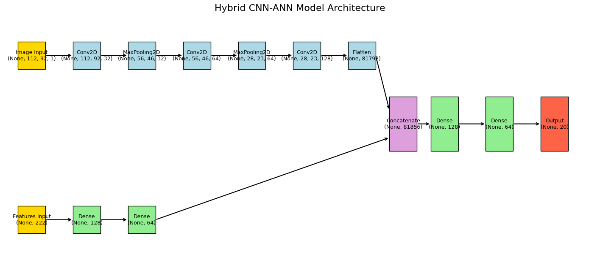
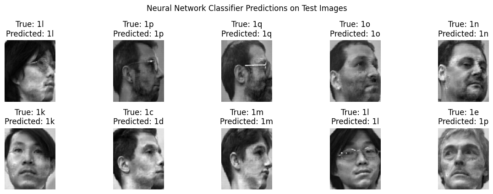

# Facial Recognition Classifier
A machine learning pipeline for facial recognition using the UMIST dataset. This project implements a hybrid CNN-ANN neural network architecture combined with PCA for dimensionality reduction and Hierarchical Clustering for facial grouping analysis.



## Key Results
- **Accuracy**: 93.23%
- **Architecture**: Hybrid CNN + ANN
- **Dimensionality Reduction**: PCA
- **Clustering Method**: Hierarchical Clustering

## Dataset Overview

### UMIST Dataset
- **Total Subjects**: 20 people
- **Images per Subject**: 20 images per person
- **Total Images**: 400 facial images
- **Labeling**: Each of the 20 labels corresponds to one unique person

The dataset contains grayscale facial images with varying pose and lighting conditions, which makes it ideal for testing robust facial recognition algorithms.

## Project Structure

```
facial_recognition_classifier/
├── data/            # UMIST dataset
├── notebook/       # Jupyter notebook for analysis
└── README.md
```

## Tech Stack
- Python 3.8+
- TensorFlow/Keras
- scikit-learn
- NumPy, Pandas, Matplotlib

## Pipeline Overview

1. **Data Preprocessing**: Image normalization and augmentation
2. **Dimensionality Reduction**: PCA to reduce feature space
3. **Clustering Analysis**: Hierarchical clustering for facial grouping
4. **Feature Extraction**: CNN layers for hierarchical feature learning
5. **Classification**: ANN for final person classification

## Results


The model achieves 93.23% accuracy on the UMIST dataset and plot above displays the predicted and true labels of 10 individuals.

## References
- https://www.geeksforgeeks.org/deep-learning/difference-between-ann-cnn-and-rnn/
- https://www.tensorflow.org/tutorials/images/cnn
- https://www.geeksforgeeks.org/deep-learning/artificial-neural-network-in-tensorflow/
- Géron, Aurélien. Hands-On Machine Learning with Scikit-Learn, Keras, and TensorFlow, Third Edition 2022, Published by O’Reilly Media, Inc
- https://www.datacamp.com/tutorial/principal-component-analysis-in-python
- https://www.datacamp.com/tutorial/introduction-to-autoencoders
- https://scikit-learn.org/stable/modules/generated/sklearn.cluster.KMeans.html
- https://www.datacamp.com/tutorial/hierarchical-clustering
